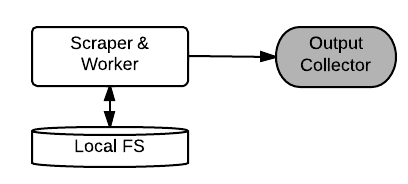
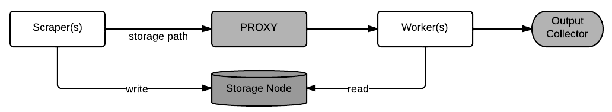
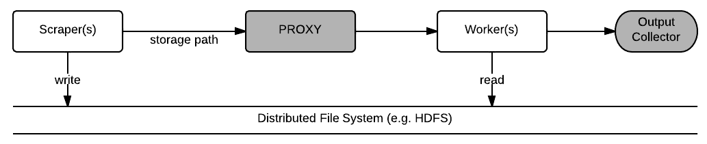
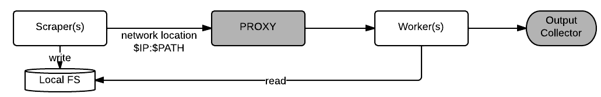

# ZMQ Remote Worker

We are am confronted with the following situation:

* A scraper process is downloading files from a remote location. The
  files are 1-10MB in size, and there are many of them (~500K).
  
* Each file shall pre processed by a worker process, which extracts
  some information (about 1K each) and passes them on to a collector
  process, which does further processing.

We search an architecture meeting the following requirements:

* Allow multiple workers. The worker task is CPU intensive and I want
  to be able to exhaust all CPU cores or multiple machines on a cluster.
* Allow multiple scrapers. Further files may be downloaded from
  different sources or on different machines.
* We want to keep a copy of the donwloaded blops at a centralized
  location. At a later time we might decide to re-ingest all the files
  at once.

We will use the [zmq messaging library](http://zeromq.org) for message passing and queing.

## Draft 1: All in one

Scraper and Worker are executed in one process,
and comunicate directly with the collector process.

* **Processes**
  - ScraperWorkers: Download blop and perform work on it.
	Dynamic component that can have several instances.
  - Collector: Receives processed data.
  	Static component, that exists only once.
* **Channels**
  - `[ScraperWorker|PUSH] -> [PULL|Output Collector]` -	output as string messages (line by line).

### Discussion

* Pros:
  - Simple architecture
  - few static pieces (only the Collector)
* Cons
  - Parallelism of worker threads coupled to download scripts.
  - Monolytic architecture violates principle of [separation of concerns](http://en.wikipedia.org/wiki/Separation_of_concerns)
  - Central storage of the downloaded files has to be added.

The architecture is clearly not optimal, although it might get you a
long way. There can be many ScraperWorkers, that give room for
parallelism.  In my application the download is the bottleneck, so
that there is not too much time wasted by waiting for the worker to
finish. The network can be easily kept saturated with a few more
ScraperWorker tasks.

There is a architecture principle, that is violated here, of spreading
out the work in as may intermediate steps as possible. In this way
testing and monitoring becomes easy. Process steps can be reused, and
paralellism can be added preciesly where the current bottlenecks are.
When the implementation is matured several steps of the architecture
might be squashed to a single step.

## Draft 2: Pass everything

Pass the donwloaded blops as messages to the worker. Add a proxy to
allow dynamic allocation of workers and scrapers.
 

* **Processes**
  * Scrapers. Dynamic component.
  * Proxy. Static component. Collects downloaded files, passes them to workers.
  * Workers. Dynamic component.
  * Collector.
* **Channels**
  * `[Scraper|PUSH] -> [PULL|Proxy]` - pass downlaoded blop as binary message.
  * `[Proxy|PUSH] -> [PULL|Worker]` - pass downlaoded blop as binary message.
  * `[Worker|PUSH] -> [PULL|Collector]` - output as string messages.

### Discussion
* Pros:
  * Simple design
  * Separation of Concerns
* Cons:
  * Downloaded blops are transfered through network twice.
  * Changing the architecture by adding routing is expensive.
  * Central storage of the downloaded files has to be added.
  * Reingest of the data requires re-download of files

# Draft 3: Central storage

Scraper store downloaded blops on a centralized storage node.

# Draft 4: Distributed storage

# Draft 5: Scraper storage

